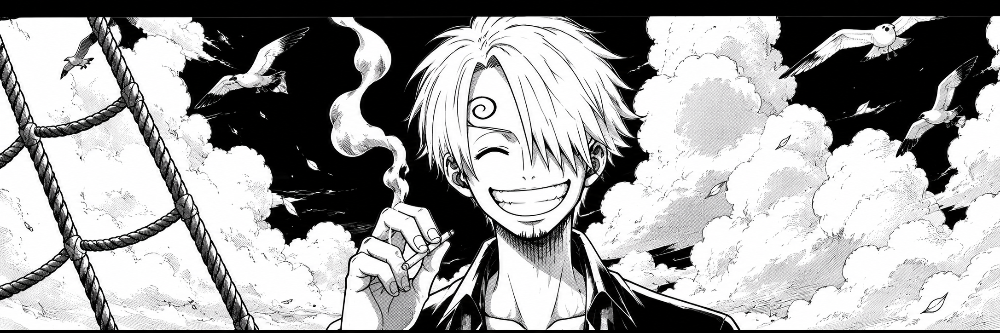

## 📊 GitHub Stats & Trophies

  
  

  

## 🛠️ Languages & Tools

  

<picture>
  <source media="(prefers-color-scheme: dark)" srcset="https://raw.githubusercontent.com/abozanona/abozanona/output/pacman-contribution-graph-dark.svg">
  <source media="(prefers-color-scheme: light)" srcset="https://raw.githubusercontent.com/abozanona/abozanona/output/pacman-contribution-graph.svg">
  
</picture>
<!-- Auto-update: 2026-08-30 22:02:16 -->